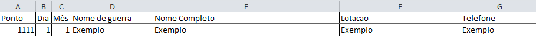

# Automação de Aniversariantes

**Automação de Aniversariantes** é uma automação web desenvolvida em Python, para facilitar a gestão e acompanhamento de aniversariantes, enviando automáticamente mensagens via WhatsApp Web.

---

## 📋 Funcionalidades

- **Idenficação automática de aniversariantes:**

  - Verifica dados referentes a datas de aniversários, contidos em uma planilha Excel, e gera uma mensagem de texto contendo os aniversariantes do dia.
    > Sexta-feira a automação também indica se existem aniversariantes no sábado e domingo.

- **Envio automático de mensagem:**

  - Através de uma sessão (Chrome) previamente configurada no WhatsApp Web, mitigando a necessidade de leitura do QR Code toda vez que o programa executar.
    > O caminho do perfil Chrome a ser utilizado é definido dinâmicamente, através de um arquivo "config.ini".

- **Compatibilidade:**
  - O programa opera diretamente com o navegador Chrome e depende de arquivos Excel para extração de dados.

---

## ✅ Requisitos

- Para o funcionamento adequado da automação, algumas planilhas e um arquivo de configuração, são essenciais.
- Utilize termos, nomes de pasta ou arquivos, exatamente como o descrito aqui.  
  _OBS: Cada campo listado abaixo deverá ser uma coluna na planilha, contendo na primeira linha o termo que identifica cada coluna._  
  Exemplo:  
  

1. **Pasta na Área de Trabalho (Desktop) > `Aniversarios`:**

   - Pasta na Desktop que irá conter todos os arquivos necessários para a automação.

2. **Planilha > `aniversariantes.xlsx`:**

   - Planilha contendo informações relevantes de cada funcionário.  
     **Neste caso as informações relevantes a demanda são, em ordem:**
     - `Ponto`: Identificador único.
     - `Dia`: Dia de nascimento.
     - `Mês`: Mês de nascimento.
     - `Nome de guerra`: "Apelido" do PLF.
     - `Nome completo`: Nome completo do PLF.
     - `Lotação`: Local de trabalho do PLF.
     - `Telefone`: Número do telefone do PLF (com DDD).

3. **Planilha > `diretor.xlsx`:**

   - Planilha contendo informações relevantes do diretor do departamento, que irá receber a mensagem contendo os aniversariantes.
     **Estrutura da planilha:**
     - `Diretor`: Telefone do diretor(somente números).
     - `Nome`: Nome do diretor.

4. **Arquivo > `config.ini`:**

   - Arquivo de configuração contendo o caminho até o perfil do Chrome a ser utilizado.  
     _Copie o conteúdo abaixo, colando dentro do arquivo de configuração, trocando PONTO_USUARIO, pelo número de ponto real do usuário._
     **Conteúdo do arquivo:**
     - [chrome]  
       profile_path = C:\Users\PONTO_USUARIO\AppData\Local\Google\Chrome\User Data

5. **Navegador Google Chrome atualizado:**

   - Navegador que será utilizado pela automação
   - **OBSERVAÇÕES IMPORTANTES:**  
     _Antes de executar o programa, o WhatsApp Web deve estar devidamente logado na conta que enviará a mensagem._
     1. Abra o Chrome, leia o QR Code do Whatsapp Web e espere carregar.
     2. Salve qualquer trabalho importante que estiver fazendo no navegador.
     3. TODAS as intâncias do navegador Chrome serão encerradas, antes da automação iniciar.

---

## ⚙️ Instalação e Configuração

1. **Pré-requisitos:**

   - Tenha o Python instalado (somente para geração do executável).
   - Instale as dependências do projeto (somente para ajustes):
     ```bash
     pip install selenium pandas openpyxl pyinstaller
     ```

2. **Geração do executável:**

   - Caso precise recriar o executável, utilize o comando:
     ```bash
     pyinstaller --onefile AutomacaoAniversariantes.py
     ```
   - O executável gerado estará na pasta `dist/`.

3. **Configuração do Agendador de Tarefas:**

   - No Windows, abra o **Agendador de Tarefas**.
   - Crie uma nova tarefa com os seguintes parâmetros:
     - **Ação:** Executar o executável gerado (`AutomacaoAniversariantes.exe`).
     - **Horário:** Defina o horário desejado para execução (ex.: 7h30).
   - Certifique-se de que o caminho para o executável e as planilhas está correto.

4. **Estrutura de arquivos:**
   - Garanta que a pasta `Aniversarios` esteja na área de trabalho.
   - Garanta que a planilha `aniversariantes.xlsx` esteja na pasta `Aniversarios`.
   - Garanta que a planilha `diretor.xlsx` esteja na pasta `Aniversarios`.
   - Garanta que o arquivo `config.ini` esteja na pasta `Aniversarios`.

---

## 🖥️ Uso do Programa

### Passo a passo:

1. **Prepare as planilhas:**

   - Atualize os aniversariantes na planilha `Aniversariantes.xlsx`.
   - Certifique-se de que a planilha `Diretor.xlsx` está atualizada.

2. **Execução automatizada:**

   - O programa será executado automaticamente pelo Agendador de Tarefas no horário configurado.
   - As mensagens serão enviadas automaticamente ao número do diretor identificado.

3. **Resultado:**
   - Caso existam aniversariantes, as mensagens serão enviadas automaticamente.
   - Se não houver aniversariantes no dia, o programa exibirá uma mensagem informativa no log.
   - Dois arquivos serão gerados na área de trabalho:
     1. `aniversariantes.txt`: Contendo as mensagens de aniversário geradas ou informando que não existem aniversariantes para a data em questão.
     2. `log_erro_aniversariantes.log`: Arquivo de log contendo todos os registros de log (caso existam) informando o usuário de erros de execução ou alertas informativos.

---
